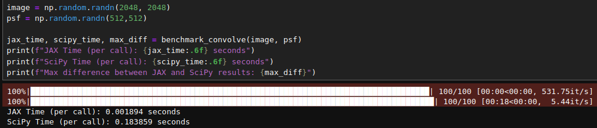

```
              %++   +%*+
            +#@@&  +#@@@%
           +#@&@@ +#@&@@#                                              **   *
          +#@% #@%#@&+@@%                 %%******+                   +@&  &*       +++++++++
         +##*  %###& +@@+     +*%%%*     &@%%&#@#&%+      *%%%%%&&+   *@+ +#       *@@##&%%%%+      %*   *%+
        +@@*   +&@#  *@#    *##&**##+   &@&@@@#%+        *@#%%%%*+    ##%%#&      %##@###&%        &@@+ &@&
       +@#*     +%   *@&   *@%    *@%  &#+  +**%#%      %#*          *@+ *@+    *#@#***%%%*       &@##&&@%
      +%              %+   *#&%%%##%   *+              *#+           &*  &%    *@@###&&%**      *#@@+#@@*
     ##                      +***+                    +*             +           +            +#@@@% +*+
     *+                                                                                     +%@@@#*
                      ++*%%&&##@@@@@@@@####&&%%*+++**%%%%%*                               +&@@@#%
                +*%&#@@@@@#&%%**++++++****%&&##@@@@@@@@@@@@#*                          +%#@@@&+
            *%#@@@@@#&&%*                     +#@@@@#&&&@@@@#                      +*&#@@#&*
        +&#@@@@#&**+                          #@@@@*    &@@@@%*+            ++**%&#@@@#%+
      +%@@@@#%+                               #@@@@@##&#@@@@##@@@#########@@@@@@#&&*+
    +%@@@@&*                                  +&@@@@@@@@@@#*   +****%%%%%%***++
   *#@@@&+                                       +**%%%%*+
  +@@@@*
  +&#+
```


# `morphen`
## 1 A gentle overview: potentials and limitations
`morphen` is not a standalone software. Rather, it is a collection of astronomical 
functionalities for image analysis and processing. 
These tools involve pure python, but also are integrated with CASA 
(https://casa.nrao.edu/) in order to work with common `casatasks` as well `wsclean` -- a 
code for fast interferometric imaging (https://wsclean.readthedocs.io/en/latest/).

In the `morphen` side, you will find tools for image analysis, to measure basic image 
morphology and photometry. Also, it comes with a state-of-the-art python-based image 
fitting implementation based on the Sersic function. This implementation is designed to 
be robust, fast (GPU accelerated) and easy to use (semi-automated). It works well 
with radio interferometric images, but can be used with any other type of images, such 
as optical images (WORK IN PROGRESS) (see examples). 


Currently, there is no option to install `morphen` (via `pip` or `conda`), since it is 
actually a collection of functions. 
The way it works is just download `morphen.py` and `libs/libs.py`. I am 
providing a `requirements` file which installation instructions of all 
dependencies. If you would like to use the interactive notebooks and the 
examples data, clone this entire repo (~1GB). 

[//]: # (I think creating a repo just for data examples will be a good idea, hence keep the `morphen` )
[//]: # (repo as clean and as small as possible.)

*NOTES: This readme file is under development. I am also currently adding basic usages 
to Jupyter notebooks guides. A major update and core functionalities will be provided 
September/2023 with the release of the paper.


## 2. Features

The code can be used interactively via Jupyter notebooks, or as a module.
The reason we wanted to port it also as a module is because it is practical, and 
can be run as a command line. However, the latter is still under development and not all 
argument options are available. However, the modular version can also (and we 
encourage to) be used interactively (check 2.1.1 below).


In sequence, we provide some details of the core features of `morphen`. 


### 2.1 General Image Data Processing
#### 2.1.1 Image Analysis
The directory [```image_analysis/```](image_analysis/) contains sets of 
functions to perform basic image analysis, such as image statistics, photometry,
shape analysis, etc. This is a work in progress, but it is already usable.
Collective direct results from this code are published here: `<<ADD LINK>>`.


Check the 
[```image_analysis/README.md```](image_analysis/README.md) file for more details and 
the notebook [```image_analysis/image_analysis.ipynb```](image_analysis/image_analysis.ipynb)
for examples.


#### 2.1.2 Image Fitting Decomposition
Folder [```image_decomposition/```](image_decomposition/) contains sets of functions to perform 
multipurpose image fitting decomposition. Currently it is under development, but it is 
semi-automated, and requires some interaction from the user.

Examples of how to use it can be found in the 
[```image_decomposition/morphen_sersic.ipynb```](image_decomposition/morphen_sersic.ipynb)


[//]: # (Parameter preparation )

[//]: # (for minimisation is fully-automated, but the user has to define the number of model )

[//]: # (components to be fitted to the data.)

[//]: # (It uses the LMFIT package )

[//]: # (with a GPU optmisation layer &#40;Jax&#41;. )

More details can be found in the 
[```image_decomposition/README.md```](image_decomposition/README.md) file.


[//]: # (It uses the LMFIT package with an )
[//]: # (object-oriented implementation, easy to use and manageable number of n-components. )

### 2.2 Radio Interferometric Data Processing

#### 2.2.1 Interferometric Decomposition

#### 2.2.3 CASA Utilities
(IN DEV)

#### 2.2.4 Interferometric Imaging With `wsclean`
Directory [```imaging/```](imaging/) contains a python script called 
[```imaging/imaging_with_wsclean_v3.py```](imaging/imaging_with_wsclean_v3.py) which is just a support code 
for easy use to call wsclean on the command line. See the intructions file of 
how to use it: [```imaging/wsclean_imaging.md```](imaging/wsclean_imaging.md)


#### 2.2.5 Selfcalibration and Imaging with `wsclean`.

In previous versions of this module (not available in this repo), all self-calibration 
routines were done with CASA. However, some changes were made and in this repo we 
provide an automated way to perform self-calibration, which uses `wsclean` as imager and 
CASA to compute the gain corrections. 

To check how to use it, see the 
[```selfcal/README.md```](selfcal/README.md) file and examples in 
[```selfcal/selfcalibration.ipynb```](selfcal/selfcalibration.ipynb).


File [```selfcal/imaging_with_wsclean.py```](selfcal/imaging_with_wsclean.py) is a wrapper
to call `wsclean` on the command line, with pre-defined parameters already set. You can 
use it to perform imaging with `wsclean` in a simple way and change parameters as 
required. Note that not all parameters are available in this wrapper.

The file [```selfcal/auto_selfcal_wsclean.py```](selfcal/auto_selfcal_wsclean.py) 
is a script to perform self-calibration with `wsclean` and `CASA`. Is fully automated, 
but is still in development. Check the 
[```selfcal/README.md```](selfcal/README.md) file for more details.

#### 2.2.6 Selfcalibration and Imaging with `CASA`.

## Our Philosophy
***Better science is done with better practices***

We are commited to transparency in science, sharing all the tools and data. 

We think about science as a collective effort, not personal achievements. 

## What is the bird in the logo?
It is a [**Southern lapwing**](https://pt.wikipedia.org/wiki/Quero-quero),
or in portuguese, *Quero-quero*, which means "I want-I want". It is a cultural 
identity in south, of America, specially south of Brazil. 

[//]: # (https://upload.wikimedia.org/wikipedia/commons/e/e8/Southern_lapwing_%28Vanellus_chilenis_lampronotus%29.JPG)


# A - Dependencies
This code depends upon multiple astronomical and signal processing packages and specific applications/interfaces required for functionalities and optmimisations. All these are explained below. 

## A.1 - CASA within Conda
At the momment, some libraries dependS on the modular CASA pacakge (in Python).
To use the collection of functions inside `morphen`, the recommended way to 
install the modular version of CASA is using `conda` environments. 
Another reason is that this is the easiest way to merge CASA functions with other python interfaces, such as `Jax`. 

To keep it short, you may want to install `miniconda`:  
```
wget https://repo.anaconda.com/miniconda/Miniconda3-latest-Linux-x86_64.sh
chmod +x Miniconda3-latest-Linux-x86_64.sh
sh Miniconda3-latest-Linux-x86_64.sh
```

After, create a new conda environment (e.g. python 3.8 is more appropriate to be used with CASA):
```
conda create -n my_env python=3.8
```

To install casacore within conda, follow the instructions in this page: 
https://github.com/conda-forge/casacore-feedstock

```
conda config --add channels conda-forge
conda update --all
```

Install `casacore` and `casatools`.
Search for different versions:
```
conda search casacore
```

Below I am installing the MPI (and last) version of `casacore`. 


```
conda install -c conda-forge casacore=3.5.0=mpi_openmpi_py311ha93ce0c_9
```

You should get a message like this:

```
Preparing transaction: done
Verifying transaction: done
Executing transaction: -
For Linux 64, Open MPI is built with CUDA awareness but this support is disabled by default.
To enable it, please set the environment variable OMPI_MCA_opal_cuda_support=true before
launching your MPI processes. Equivalently, you can set the MCA parameter in the command line:
mpiexec --mca opal_cuda_support 1 ...

In addition, the UCX support is also built but disabled by default.
To enable it, first install UCX (conda install -c conda-forge ucx). Then, set the environment
variables OMPI_MCA_pml="ucx" OMPI_MCA_osc="ucx" before launching your MPI processes.
Equivalently, you can set the MCA parameters in the command line:
mpiexec --mca pml ucx --mca osc ucx ...
Note that you might also need to set UCX_MEMTYPE_CACHE=n for CUDA awareness via UCX.
Please consult UCX's documentation for detail.
```


Install CASA related packages with pip:
```
pip install casatools 
pip install casatasks casaplotms casadata casaviewer casampi casaplotserver
```

In order to use casaviewer, you have to downgrade `protobuf` to version 3.20.3:
```
pip install protobuf==3.20.3
```


v


Then, install python related packages:
```
pip install ipython notebook jupyter tqdm numpy astropy matplotlib pandas corner sympy cmasher coloredlogs
```


#conda config --add channels pkgw-forge

## A.2 - Image Fitting
Image fitting is performed with the `LMFIT` package, alongside `scipy` and the Monte Carlo `emcee` package. 
```commandline
pip install lmfit==1.1.0 emcee h5py corner arviz
conda install arviz
```

Note: At the momment, for and unknow reason, minimisation using Jax is not happening in the desired way if using the last stable 
version of `LMFIT (v 1.2.1)`, but it does for v 1.1.0. So, while the issue is not identified, please use this particular
version of `LMFIT`.

## A.3 Image Shape Analysis
Some utilities are used to quantify image structure. For that, python packages that are used are:
```commandline
pip install scikit-image scikit-learn 
```
## A.4 Photometry
```commandline
pip install petrofit #--no-deps #avoid issue with deprecated sklearn (already installed with scikit-learn)
pip install photutils sep fitsio
```
## A.5 - Jax Interface for Optmisation and GPU Processing
Some functions are decorated within Jax framework in order to be optmised for CPU or to run on Nvidia GPUs. 
Jax can be installed with cuda-12.0. The recommended way is to install within a conda environment (the same created 
before). See more instruction in https://github.com/google/jax#installation. 

### When Nvidia GPU is available
#### Cuda 12
```commandline
pip install --upgrade "jax[cuda12_pip]" -f https://storage.googleapis.com/jax-releases/jax_cuda_releases.html
```
#### Cuda 11
```commandline
pip install --upgrade "jax[cuda11_pip]" -f https://storage.googleapis.com/jax-releases/jax_cuda_releases.html
```


### CPU Only
```commandline
pip install --upgrade pip
pip install --upgrade "jax[cpu]"
```

Note: In either case, the code can be run independently of the system. Jax will automatically detect if a GPU is 
available or not. If not, the code will run on CPU, but will be optmised and benefit from multi-core processing. 

### Comments on Performance
Using Jax, run time can be reduced by a factor of 10-20 if running in a CPU, or by a factor of 100-500 if running in a GPU!
However, more detailed benchmarks are required. If you would like to contribute, please contact me. 


## Cupy (deprecated)
In initial experiments, GPU opmitisation was made via `cupy`, but will be removed in future versions.
```commandline
pip install cupy
```

## Logging
Morphen uses `logging` and `coloredlogs` for logging:
```
pip install logging coloredlogs
```

## Known Issues
### CuDNN Version
Loaded runtime CuDNN library: 8.5.0 but source was compiled with: 8.9.1.  CuDNN library needs to have matching major version and equal or higher minor version. If using a binary install, upgrade your CuDNN library.  If building from sources, make sure the library loaded at runtime is compatible with the version specified during compile configuration.


## Names
Morphen Ratropia
Morphen Ratromia
Radio Morphen Ratropia

