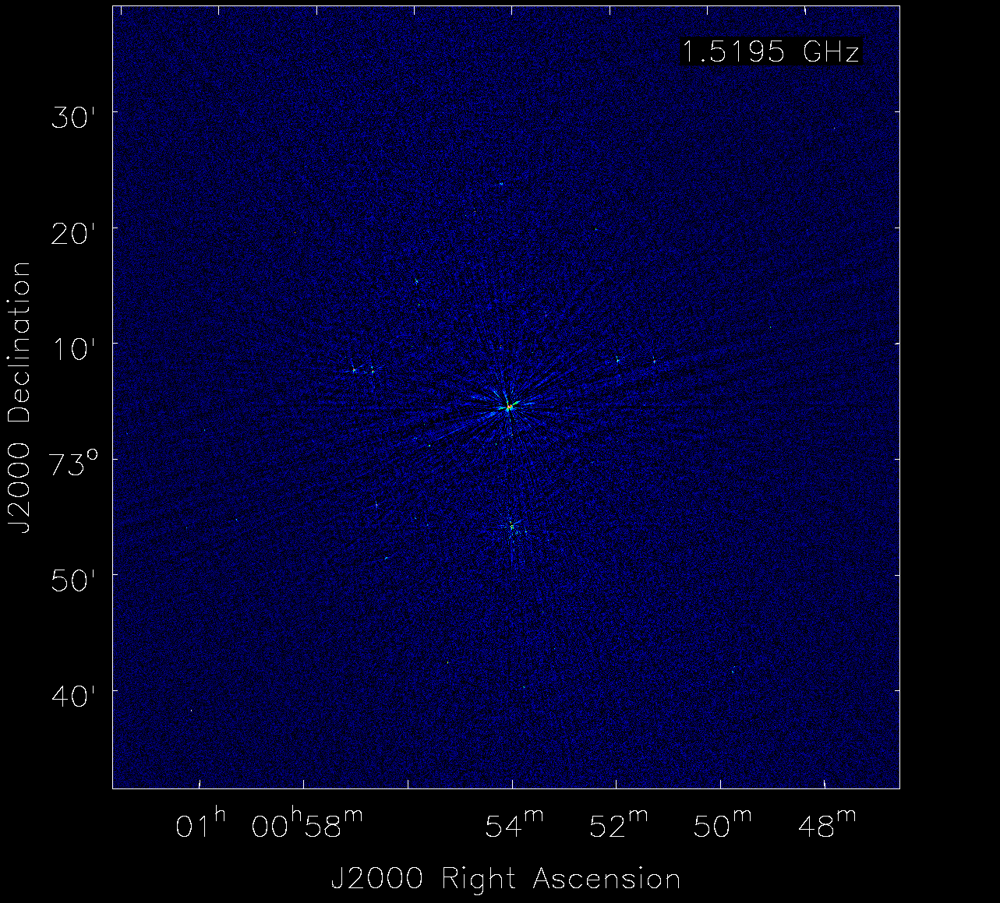
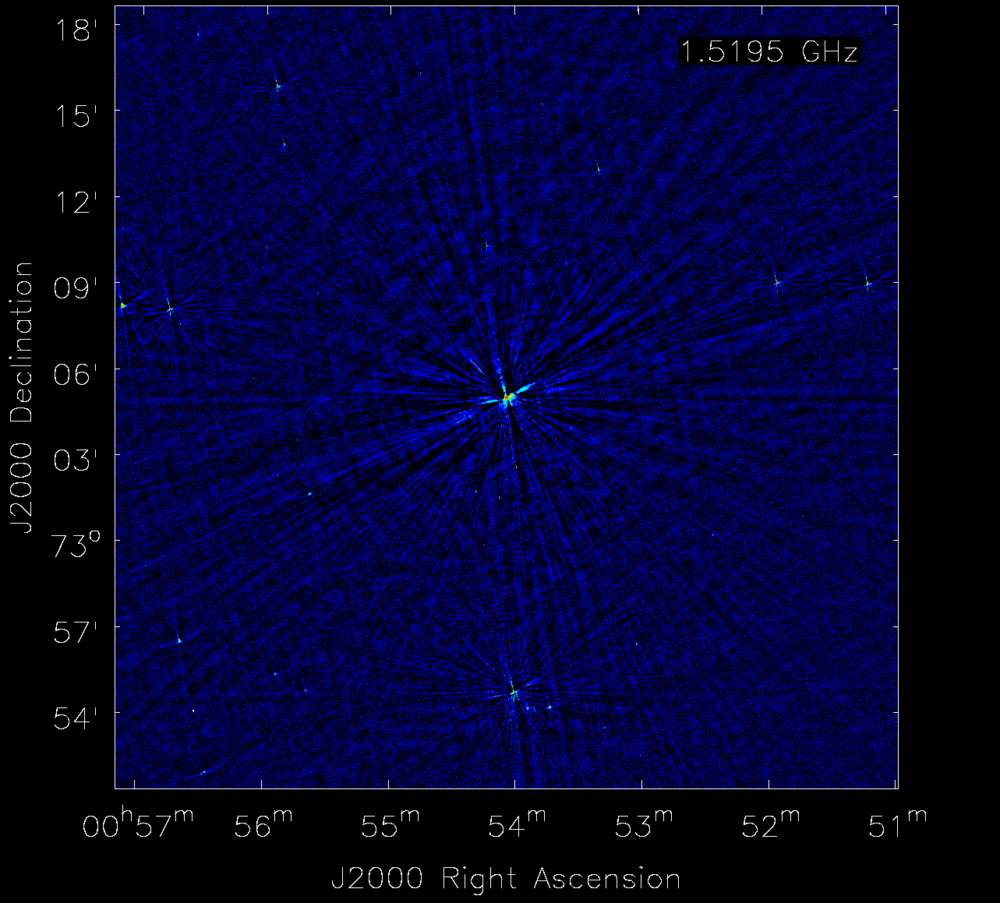
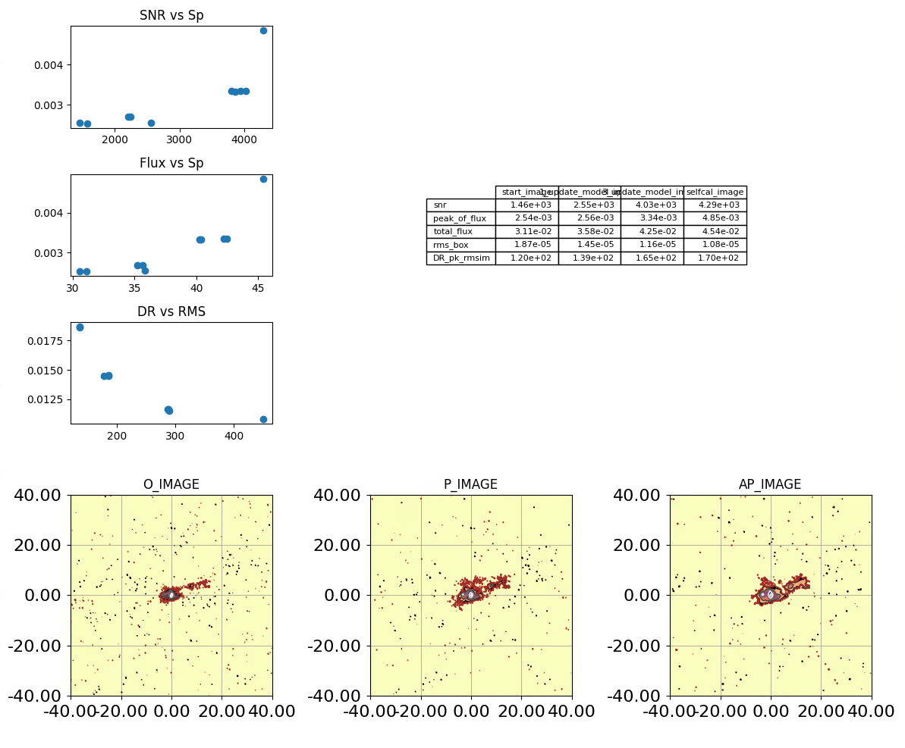

# Self-calibration Strategy

***This documentation is still under construction.***

This module is designed to perform self-calibration on radio interferometric data.
It uses the `wsclean` code as imager and `CASA` as a calibration tool.

## Scripts and Packages
The self-calibration module within `morphen` consists of two main scripts and a library file:
- [`auto_selfcal_wsclean.py`](https://github.com/lucatelli/morphen/blob/main/selfcal/auto_selfcal_wsclean.py):
  The script responsible to run the self-calibration.
- [`config.py`](https://github.com/lucatelli/morphen/blob/main/selfcal/config.py): 
  Configuration file used by `auto_selfcal_wsclean.py`. It contains all the relevant information 
  to run the code.  
- [`imaging_with_wsclean.py`](https://github.com/lucatelli/morphen/blob/main/selfcal/imaging_with_wsclean.py):
  A stand-alone wrapper to run `wsclean` with pre-defined arguments. 
  It handles `wsclean` installed natively or via singularity. 
- [`../libs/libs.py`](https://github.com/lucatelli/morphen/blob/main/libs/libs.py):
  A general library file with functions used by `auto_selfcal_wsclean.py`.


### Requirements
Tested versions of `CASA` and `wsclean` are:
- `casacore` version 3.5.2
- `casatools` version 6.6.0.20
- `casatasks` version 6.6.0.20
- `wsclean` version 3.1, 3.3, 3.4

Note that `CASA` packages refers to the modular version (installed with conda and/or 
  pip within an environment).

We refer to [install_instructions.md](..%2Finstall_instructions.md) for details of a 
full installation.

Regarding `wsclean`, if you would like to build yourself, check https://wsclean.readthedocs.io/en/latest/installation.html 
for installation instructions. 
If you have `singularity` installed in a singularity container, you will need to modify two 
lines in the `imaging_with_wsclean.py` script.
1. In the line that parses the installation mode of `wsclean`, argument `--wsclean_install`, 
   change the value from `default='native'` to `default='singularity'`.
2. Then you will need to specify the location of the singularity container, below the line `if 
   running_container == 'singularity':`. Specify the location of the container with 
   `wsclean_dir = '/path/to/container/with/wsclean/container.simg'`.

   

### Running the code
You can run the code in three different ways: from the command line (no interactive); using  the 
`ipython` command line interface (interactive); or using a Jupyter notebook (interactive). The 
jupyter mode was not tested yet. But in any way, we recommend using `ipython`. 

Using `ipython`, you can run the code as:
```shell
sagauga@stardust:~$ conda activate morphen
(morphen) sagauga@stardust:~$ ipython -i auto_selfcal_wsclean.py
```
or 
```shell
sagauga@stardust:~$ conda activate morphen
(morphen) sagauga@stardust:~$ ipython
Python 3.8.18 | packaged by conda-forge | (default, Dec 23 2023, 17:21:28) 
Type 'copyright', 'credits' or 'license' for more information
IPython 8.12.3 -- An enhanced Interactive Python. Type '?' for help.

In [1]: exec(open('./auto_selfcal_wsclean.py').read())

```

In both cases, the ipython session will be open at the end, in case you require further 
investigation of the results.

You can also run the code from the command line as:
```shell
sagauga@stardust:~$ conda activate morphen
(morphen) user@stardust:~$ python auto_selfcal_wsclean.py
``` 

Note: This script was only tested in a single machine. It was not tested in a cluster with 
multiple nodes. We will need to build a singularity container with `wsclean` that is able to 
paralelise the imaging jobs on multiple nodes. For that, clusters may require very specific 
versions of MPI and other libraries, and those must be compatible with `wsclean`. 

[//]: # (ipython auto_selfcal_wsclean.py -- -h)

### Limititations with `wsclean`
- Different of `CASA`, `wsclean` does not have a feature to provide outlier-fields. So, your 
image can become large if you want to include sources far away from the phase centre. 
- As of now, primary beam correction is not supported in `wsclean` when (i) imaging 
  combined data, having different fields in the measurement set, and when (ii) imaging 
  e-MERLIN observations. 

### Benefits of `wsclean`
- Irrespective of the size of the images, wsclean is designed for wide-field 
imaging, and it will perform very well even if you have large images. Also, this code will feed 
  masks to `wsclean` (in combination with the `wsclean` built-in auto-masking). So, 
  even if you have a large image, cleaning on masked regions will be faster in 
  comparison to cleaning the entire visibility grid. 
- I have performed experiments with `CASA` and `wsclean` and I have found that `wsclean` is 
  performing better when imaging fainter sources, specially at higher VLA frequencies, or 
  imaging e-MERLIN data. 
- Having negative components during cleaning is normal. However, in some cases, such 
  negative components are added to the model at the edge of the masking regions. This 
  can produce negative artefacts on your final image, specially for fainter sources.
  This is easier to control and avoid with `wsclean` than with `CASA`, specially when 
  providing a mask before deconvolution.

### Issues during self-calibration
***More info to be added here.***

There were a few cases where we ran this code in some VLA observations, and the data 
did not show any improvement. More investigation is required to understand why. It may 
be due to antenna issues, etc. We kindly ask that if you encounter similar issues, 
please report to us, informing if the problem is the data or the code. If it is okay, 
please you may also share the data (it can be averaged, for debugging purposes).   

## Brief Overview of Self-Calibration
Self-calibration is a process in which complex gain corrections are estimated from the 
data itself. The traditional way of self-calibration is an iterative process and a 
time-consuming task. This code will help you to mitigate that, by automating most 
steps required during self-calibration. It will also perform faster results than 
traditional ways. This code will also turn the whole process reproducible.

Before going into details, things to keep in mind:

1. Self-calibration can improve image quality by a factor of 2-10 (or more)
2. Self-calibration WILL NOT: 
   - correct data that contain strong RFIs, antenna issues, etc.
   - correct data that was not properly calibrated during phase-referencing 
     calibration, specially for fainter sources.
   - correct for missing short spacings.
   - correct data that contain very faint sources.
   - correct data when imaging parameters are not properly set. 

We refer to the literature for more details on self-calibration, in particular:


[1. Self-calibration and improving image fidelity for ALMA and other
radio interferometers](https://arxiv.org/pdf/2207.05591.pdf)

[2. Online presentation by Joshua Marvil](https://science.nrao.edu/science/meetings/2021/vla-data-reduction/presentations/Selfcal_NRAO_DRW_2021.pdf)

[3. Online presentation by A.M.S. Richards](https://almascience.eso.org/euarcdata/itrain06/Self-Calibration_Advanced.pdf)

[4. VLA Tutorial for Self-calibration](https://casaguides.nrao.edu/index.php/VLA_Self-calibration_Tutorial)


## Using the code

### Preparing and knowing the data
There is additional prior information to have in mind before running this code, since 
some parts are not automated:
- What is the frequency of your observations?
- Is your source bright or faint? 
- If your source is faint, do you have a bright source nearby in field that you can 
  use for self-calibration? 
- Irrespective of the source brightness, do you have a bright source nearby in field 
  that you must include in the imaging process? See the effects of not including 
  outlier bright sources during convolution. 

### Config file `config.py`
In the configuration file `config.py`, you can set all the required information in order for the 
code to work. Basically, you start by defining where your data is located:
```python
path = '/path/to/your/data/'
vis_list = ['name_of_the_measurement_set']  # do not use the .ms extension
```
Details of how the parameter session in `config.py` file was written is explained sequence.

### General steps performed by the code
The code will run all the steps that are defined in the `steps` list, in the config file 
`config.py`. Currently, the following steps are available:

```python
steps = [
    'startup',  # create directory structure, start variables and clear visibilities.
    'save_init_flags',  # save (or restore) the initial flags and run statwt
    #'fov_image', # create a FOV image
    #'run_rflag_init', # run rflag on the initial data (rarely used)
    'test_image',#create a test image
    'select_refant', #select reference antenna
    'p0',#initial test  of selfcal, phase only (p)
    'p1',#continue phase-only selfcal
    'p2',#continue phase-only selfcal (incremental)
    'ap1',#amp-selfcal (ap)
    'split_trial_1',#split the data after first trial (and run wsclean)
    'report_results',#report results of first trial
    #'run_rflag_final',#run rflag on the final data
]
```
However, not all the steps may me excuted, depending on the data.
After the initial imaging test,`test_image`, an evaluation is perfoemed to check what is the 
total flux density of the radio map. If the source is too faint, only steps `0`and `3` will 
be exceuted. If the source is bright, steps `p0`, `p1`, `p2`, and `p3` will be executed.
Note that step `p3` perform a phase-amplitude self-calibration. This is the most dangerous, and 
a split will be performed before this step. So you will have both measurement sets 
and images, before and after the amplitude self-calibration. Note that, usually, 
amplitude self-calibration should not be performed for faint sources. Above, we 
mentioned that for faint sources, step `p0` and `p3` will be executed, and that is for 
completeness purposes. The user must inspect and compare the quality of images in each 
case, when dealing with faint sources. 

#### Step-by-step explanation
- `startup`:
  1. This step will create a directory structure where some files are going 
    to be saved. 
  2. It will initialise variables where information about the data will 
    be saved.
  3. Delete current `MODEL` column in the data with `delmod`, and clear the visibilities with 
     `clearcal`.
- `save_init_flags`:
  1. save the initial flags of the data; or restore the original flags if you are re-running the 
     script. 
  2. It will run `statwt` on the data (if not already ran). 
- `fov_image`: This step will create a large image of the field of view (FOV) of the 
  data. This is useful to understand your entire FOV, identifying bright sources, or 
  multiple faint sources that can be collectively used for self-calibration. Check the 
  parameters of this step to make sure that you are imaging the entire FOV or just a portion. 
- `run_rflag_init`: This step will run `rflag` on the data. This is useful to remove 
  some RFI that can be present. This step is really required only when 
  strong RFIs are present. In general, we evaluate if this is required for L-band 
  data only. This step is rarely required for higher frequencies. 
- `test_image`: This step will create a test image of the data. This test image will 
  provide basic prior information about the data, such as total flux density, SNR and 
  peak brightness intensity. The information gathered in this test image is used to 
  select which imaging and calibration parameters will be used in subsequent steps. 
  More details are provided later.
- `select_refant`: This will compute test gain solutions and sort all antennas into 
  a list, based on the fraction of good solutions. This list is passed to the argument 
  `refant` in the `CASA` task `gaincal`.
- `p0`: This step will perform the first phase-only self-calibration, which comprises 
  the following steps:
  1. Create another test image (with the subscript `test_image_0`) that will be used to create a mask. 
     In this imaging run, the `model` column will not be updated (`--no-update-model-required` 
     in `wsclean`). 
  2. Use the previous generated mask to limit where the convolution will be performed. 
     This mask will be given to `wsclean` with the `-fits-mask` argument. Then and imaging run 
     will happen, updating the `model` column in the end.
  3. The task `gaincal` will be called to calculate the complex gain solutions. 
     The solutions will be applied to the data with the task `applycal`.
  4. After the solutions are applied, a self-cal test image will be created (with the 
     subscript `selfcal_test_0`). This image will be used to evaluate the 
     quality of the self-cal solutions. These image will be used later to compare how the 
     quality changes across the self-calibration process.
  5. Finally, this new image will be used to infer if the template of parameters used needs to 
     be changed in all the subsequent steps. This may happen if the image quality had a 
     significant improvement that resulted in a higher total flux density, SNR, etc.
- `p1`: Continue the same phase-only run as `p0`, but with a different set of imaging and 
  calibration parameters (unique to the `p1` step). This step will only be performed if the 
  image has enough flux density. We provide more details about this later on. If excuted, the 
  gain table generated in `p0` will be ignored.
- `p2`: Continue the same phase-only run as `p1`, with different set of imaging and 
  calibration parameters. This step will also be performed only if the image match the template 
  parameter selection. If excuted, the gain table generated in `p1` will be used, hence the 
  solutions in `p2` will be incremental to `p1`, correcting the residual phase errors on shorter 
  time-scales.
- `ap1`: This step will perform a phase-amplitude self-calibration. A split will be performed 
  before this step, with a measurement set containing the phase-only corrections. If only `p0` 
  was executed, `ap1` will use the phase solutions from `p0`. If `p1` and `p2` were executed, 
  `ap1` will use the phase solutions from both. If `p2` was not executed, `ap1` will use `p1`. 
  The exact `gaincal` parameters in each one of these stages are found in the `config.py` file.


#### What the code tracks along the self-calibration process?

- For consistency, outside the self-calibration routines, the code will call `wsclean` 
to create `selfcal_test_images` after each complex gain solution applied to the data. 
We use these images to track how the image quality changes along every self-calibration step.
- To each image, an `image_properties` dictionary will contain statistical image 
  properties measured in each one of the images. A final `.csv` file will be created 
  containing all the information from all images (with each step specified).
- An additional dictionary will be saved at the end with information of the gain 
  tables that were applied along the way. 


### Running the code for the first time on a new dataset. 
Basically, this is the most general way to test the code: (i) the radio emission 
is unknown (never imaged before, at least by you). 
The dictionary `init_parameters` contains parameters that are required to run 
initial steps and that are going to be used in subsequent parts later (see below).


Ideally, you may want to run the steps until `fov_image` and from that, check what 
will be the image size and possible phase-shift that you would want to use in all 
subsequent steps of self-calibration. Once you are happy with everything, you can use 
the dictionary `init_parameters` with the `global_parameters` dictionary and set 
the parameters for all subsequent steps. Note that other parameters used for imaging 
are data/steps dependent and are explained below.  

[//]: # (For example, typical configurations for `init_parameters` and `global_parameters` are:)

[//]: # (```python)

[//]: # (init_parameters = {'fov_image': {'imsize': 1024*8,)

[//]: # (                                'cell': '0.2arcsec',)

[//]: # (                                'basename': 'FOV_phasecal_image',)

[//]: # (                                'niter': 100,)

[//]: # (                                'robust': 0.5},)

[//]: # (                  'test_image': {'imsize': int&#40;1024*3&#41;,)

[//]: # (                                 'imsizey': int&#40;1024*3&#41;,)

[//]: # (                                 'FIELD_SHIFT':None,)

[//]: # (                                 'cell': cell_sizes_JVLA['X'],)

[//]: # (                                 'prefix': 'test_image',)

[//]: # (                                 'niter': 10000,)

[//]: # (                                 'robust': 0.0})

[//]: # (                  })

[//]: # (```)

#### Creating the FoV image.
For the FoV image, we do not have to use a proper pixel size. For example, from the 
Nyquist theorem, we would require ~ 5 pixels to sample the PSF. For example, with the 
most extended VLA configuration at C band, the theoretical resolution is about 0.3 arcsec.
A good value for the pixel size (determined by the `cellsize` argument) would be 0.3/5 
~ 0.06 arcsec. For the FoV image, we can use 0.3/2.5, for example. This will speed up 
things if larger images are required.

The FoV image can be used to estimate if a phase-shift is required to properly image
all sources of interest around the science source, while trying to reduce the image 
size. The idea is to fit all relevant sources in the smallest image possible.

Note: You can skip this step if you are sure that there is nothing significant in the 
FOV that can be used for self-calibration. You can use prior information from NVSS, 
FIRST, or other surveys. For example, you can check if there are other sources in the 
FOV or you want to calculate what is the phase shift coordinates that you want to use 
with  `FIELD_SHIFT`. Remember that you may  need to compute conversions for the pixel 
size, image sizes, etc, from those surveys to accommodate with the imaging of your 
observation in case instruments/frequencies differ.

A typical configuration of the imaging parameters for this step (within 
`init_parameters`) is:
```python
'fov_image': {'imsize': int(1024*12),
              'cell': '0.15arcsec', #C and X band VLA-A config
              'basename': 'FOV_phasecal_image',
              'niter': 100,
              'robust': 0.5},
```


#### Creating the initial `test_image`

The initial test image is performed with the `test_image` step. After you are happy with 
your image size, and/or need to apply a phase shift, you can use the sub-dictionary 
`test_image` within `init_parameters` to set up such basic configurations. For the 
test image, for example, we have 

```python
'test_image': {'imsize': int(1024*3),
               'imsizey': int(1024*3),
               'FIELD_SHIFT':None,
               'cell': cell_sizes_JVLA['C'],
               'prefix': 'test_image',
               'niter': 10000,
               'robust': 0.0}
```

The full `init_parameters` dictionary may have the following format:
```python
init_parameters = {'fov_image': {'imsize': 1024*8,
                                'cell': '0.2arcsec',
                                'basename': 'FOV_phasecal_image',
                                'niter': 100,
                                'robust': 0.5},
                  'test_image': {'imsize': int(1024*3),
                                 'imsizey': int(1024*3),
                                 'FIELD_SHIFT':None,
                                 'cell': cell_sizes_JVLA['X'],
                                 'prefix': 'test_image',
                                 'niter': 10000,
                                 'robust': 0.0}
                  }
```

Note that we should mantain a consistency when running the first test image. Using 
different weighting schemes can give different values for the total flux density. 
Independent of your data, we should create the initial test image with a natural 
scheme, such as `robust=0.0`. The only exception is when sources are very faint, and 
the code will use `robust=0.5` instead.

The basic imaging parameters set in this step, will be used in all subsequent steps of 
the self-calibration run. Specifically: `imsize`, `imsizey`, `cell`, and `FIELD_SHIFT`.
Note that other imaging parameters such as `niter`, `uvtaper`, `robust`, etc, are data 
and step dependent. They are explained later for each case. These global parameters 
are defined with the `global_parameters` dictionary. A typical example is:
```python
global_parameters = {'imsize': init_parameters['test_image']['imsize'],
                     'imsizey': init_parameters['test_image']['imsizey'],
                     'FIELD_SHIFT': init_parameters['test_image']['FIELD_SHIFT'],
                     'cell': init_parameters['test_image']['cell'],
                     'nsigma_automask' : '3.0',
                     'nsigma_autothreshold' : '1.5',
                     'uvtaper' : [''],
                     'niter':100000}
```

NOTES: By default, the `multiscale` deconvolver is disabled during `test_image`.

***Example***

In the image bellow, we show an example of the FOV image.

<br>
And, after selecting proper imaging parameters, I am showing the test image.

<br>
For this example, no phase-shift was required, as the outlier sources are well 
accommodated in the determined image size.


#### step `0`: Initial Trial of Self-Calibration
The exact parameters to be used for imaging (with `wsclean`) and with `gaincal` (`CASA`) 
are data dependent. If the source is bright enough (or the total sources in the FOV 
contain enough flux densities) for self-calibration, shorter solution intervals can be 
used during `gaincal`. Alongside, lower values of the `robust` parameter can be used 
during imaging (e.g. `robust=-1.0` or `robust=-0.5`). Otherwise, if the source is 
faint, longer solution intervals are required to be used  during `gaincal`, as well 
higher `robust` parameters (e.g. `0.5` or `1.0`). 

This code comes with a template of parameter configurations, label `params_very_faint`, 
`params_faint`, `params_standard` and `params_bright` to be used in such scenarios.
To select a good combination of parameters, some image paremeters are estimated from the 
`test_image` step, such as total flux density and SNR. In this pipeline, we use the following 
empirical criteria to select the template of parameters:
```python
def select_parameters(total_flux,snr=None):
    if total_flux < 5:
        params = params_very_faint.copy()
    elif 5 <= total_flux < 20:
        params = params_faint.copy()
    elif 20 <= total_flux < 50:
        params = params_standard_1.copy()
    elif 50 <= total_flux < 100:
        params = params_standard_2.copy()
    else:  # total_flux >= 100
        params = params_bright.copy()
    return params
```
PS: Note that the use of SNR to help in this selection was not implemented yet, as using just 
the total flux density demonstrated to be enough.

As an example, we have
```python
params_faint = {'name': 'faint',
                'p0': {'robust': 0.0,
                       'solint' : '180s',
                       'sigma_mask': 12,
                       'combine': '',
                       'gaintype': 'T',
                       'calmode': 'p',
                       'minsnr': 1.5,
                       'spwmap': [],
                       'nsigma_automask' : '5.0',
                       'nsigma_autothreshold' : '2.5',
                       'uvtaper' : [''],
                       'with_multiscale' : False},
                'p1': {'robust': 0.5,
                       'solint' : '120s',
                       'sigma_mask': 8,
                        'combine': '',
                       'gaintype': 'T',
                       'calmode': 'p',
                        'minsnr': 1.5,
                       'spwmap': [],
                       'nsigma_automask' : '3.0',
                       'nsigma_autothreshold' : '1.5',
                       'uvtaper' : [''],
                       'with_multiscale' : True},
                'ap1': {'robust': 0.5,
                        'solint': '120s',
                        'sigma_mask': 6,
                        'combine': '',
                        'gaintype': 'T',
                        'calmode': 'ap',
                        'minsnr': 1.5,
                        'spwmap': [],
                        'nsigma_automask' : '3.0',
                        'nsigma_autothreshold' : '1.5',                       
                        'uvtaper' : [''],
                        'with_multiscale' : True},
                }
```

NOTES: By default, the `multiscale` deconvolver is disabled during `p0`.

#### Templates explanation
In order to conduct the self-caliration in a more automated way, we performed multlipe 
experiments combining different imaging and calibration parameters. We also discussed 
with people at JBCA, about practices to maximise the quality and science ouptut of the 
data when dealing with self-calibration. 
From that, we have created a set of empirical templates of parameters that can be used 
in many scenarios, depending on the structure of the radio emission originated from 
the data.

##### `params_very_faint`
From the test image, if the total flux density is below 5 mJy, we should be cautious 
when doing self-calibration. We use, in this case, 
conservative approaches with longer solution intervals, higher `robust` parameters 
and/or combining scans, spectral windows and polarizations (`LL` and `RR`).
Usually, solutions will fail easily if this is not considered. 
1. In an attempt to improve the SNR, we can combine spectral windows (`combine='spw'`)
   during the very fist step of self-calibration (`p0`).  Since is tricky to improve 
   image quality with faint sources, this template will limit to just one `phase-only` 
   self-calibration step (`p0`), as running more phases  will lead to large fractions 
   of failed solutions and therefore flagged data. 
2. Another suggestion is to combine scans (`combine='scan'`) and/or using 
   `solint='inf'`.

This template of parameters will allow a sequential `amp-phase` self-calibration (`ap1`), 
incrementing solutions from the previous step (`p0`). ***WARNING***: This is a 
dangerous step, and should be used with caution. This step is run for completeness 
purposes. By default, the code will split the phase-self-calibrated data before that.

Currently, the default empirical template for this case is: 
```python
params_very_faint = {'name': 'very_faint',
                     'p0': {'robust': 0.5,
                            'solint' : 'inf',
                            'sigma_mask': 5,
                            'combine': 'scan',
                            'gaintype': 'T',
                            'calmode': 'p',
                            'minsnr': 0.75,
                            'spwmap': [],
                            'nsigma_automask' : '3.0',
                            'nsigma_autothreshold' : '1.5',
                            'uvtaper' : ['0.08asec'],
                            'with_multiscale' : False},
                     'ap1': {'robust': 0.5,
                             'solint': 'inf',
                             'sigma_mask': 5,
                             'combine': 'scan',
                             'gaintype': 'T',
                             'calmode': 'ap',
                             'minsnr': 0.75,
                             'spwmap': [],#leavy empty here. It will be filled later
                            'nsigma_automask' : '3.0',
                            'nsigma_autothreshold' : '1.5',
                             'uvtaper' : ['0.08asec'],
                             'with_multiscale' : False},
                     }
```

You may also want to change wheter you want to use `comb='spw'` or `comb='scan'` in 
each one of the steps (`p0` and `ap1`). Another tip is considering to use uv-tapering,
with the argument `uvtaper`. For simplicity, this is a Gaussian sky-taper. A good 
starting point is to use a taper with the same size as the theoretical resolution of 
the instrument (roughly 5x the cell size). For example: for the VLA-A at C band, that 
would be `uvtaper=['0.3arcsec']`; and for e-MERLIN at C band, that would be `uvtaper=
['0.05arcsec']`.

NOTES: 
- For now, please note that if this template is selected, the `multiscale` 
deconvolver is disabled in all runs (`p0` and `ap1`).
- Note also that we are using a very low `minsnr` parameter. This is dangerous and YOU 
  MUST inspect your results. 

##### `params_faint`
In case the total flux density is between 5 and 20 mJy, we can try to decrease the 
solution intervals of the solutions. But, still, we should be cautious since this is a 
typical scenario where self-cal can be doable or not in the sense of improving image 
fidelity.  


##### Switching templates
A critical point to consider is that not just one template may be used along all the 
steps. For example, consider that in step `test_image`, the image resulted a total 
flux density below 10 mJy. If the original phase-referenced image shows signs that it 
was not properly calibrated and could be improved (e.g. there is significant flux spread 
across the FOV), the first step of self-calibration (`p0`) can potentially improve the 
image quality. The resulting image can have a total flux density higher up to a factor 
2 or three (as well the dynamic range and SNR). In such situations, when running step 
`p1`, a new assessment of the image will be made (re-evaluating the total flux 
density, SNR, etc). These updated 
properties will be used to determine if a new template is required (e.g. invoking 
`select_parameters`).  Usually, this new template can be used for the rest of the 
self-calibration process. If there are no changes (e.g. given the criteria indicated 
by `select_parameters`), the same template will be used for the rest of the run.


More experiments are required, but typically for a 'standard source', during `p0` the 
template `params_faint` will be used, while during `p1` the template `params_standard_1` 
or `params_standard_2` will be selected.

##### Controlling how deep the deconvolution is performed
We use an alternative way to control how deep the deconvolution is performed. 
Typically this would be controlled with the `niter` parameter. However, another 
approach is to fix this parameter and set it large enough, and control how deep the 
deconvolution will be with the `auto-mask` and `auto-threshold` parameters. The reason 
is that `niter` can be 
subjective to the data set, whilist `auto-mask` and `auto-threshold` statistically 
robust since these quantities are based on the deconvolution itself.  


#### Plotting and logging 
During the self-calibration process, some plots are created and saved in the `plots` directory:

- Plot with histograms of the fractions of solutions per SNR
- Visibility plots (e.g. MODEL/CORRECTED_DATA), etc. 
- Phase and amplitude gains

At the end, a .csv file is saved with information from all the images that have been created, e.
  g. SNR, total flux density, peak flux density, etc. 

The image below show an example of a final plot (as a summary) of the statistics of each 
relevant selfl-calibration step.



### Examples
A series of examples using this module can be found in the `examples.md` file. See at 
[`examples.md`](https://github.com/lucatelli/morphen/blob/main/selfcal/examples.md).

### Development and testing

The following features are still under development (or contain issues) and may not work 
properly:
1. Re-running the code from a crash: this is not fully implemented yet. We suggest that 
   you delete the folder `selfcal` and rerun the code again. 
2. `gaincal` option: using different forms of `interp` rather than `linear` may lead 
   to crashes on `CASA` side. In that case, you may need to set `linear` and re-run 
   the code from start. 
3. If your splited data does not contain the same spectral windows as the original 
   measurement set, the parameter `spwmap` will not be computed properly in some 
   occasions. This requires a better handling of the `spwmap` parameter when running 
   the code on your final visibilities. An example of when this happens is when a 
   spectral window was unique to a phase or flux calibrator. The task `gaincal` will 
   still tell that the solutions to that spectral window failed in the current splited 
   visibility, even if it is nonexistent in it. 
4. The same applies to e-MERLIN observations. For the target field, some e-MERLIN 
   observations will contain scans with different spectral windows. In that case, 
   `spwmap` can be wrong.
5. The automatic handling of multiple `spwmap` along multiple tables is not implemented 
   yet. 
6. Continuing a deconvolution  (see https://wsclean.readthedocs.io/en/latest/continue_deconvolution.html).
   This is in development and experimental phase. This may be relevant in case that 
   changing the weighting schemes along the steps of self-calibration and imaging will 
   not be enough to recover the extended emission. For example, in a later step of 
   self-calibration (e.g. `p2` or `ap1`), we may want to create the images with 
   `-continue` enabled: first, just 'clean' the bright compact emission, and then 
   continue with a taber of a higher `robust` parameter.
7. Another solution to not miss extended emission across different selfcal steps, 
   may be limiting the uv-range where the solutions may be applied. Basically, the 
   solutions are more influenced by the compact emission. This will be tested and 
   available in the near future. 
8. Using the compactness of a source and other metrics, determine automatically whether 
   `multiscale` is required or not. Not using `multiscale` will speed up the entire process by 
   the same factor of the number of scales used.

### 'unknown' issues
#### `CASA` crashes while plotting with `plotms`.
We have observed some issues that are 'unknown' in nature, but may be related to 
the modular `CASA` internal routines when handling temporary directories created by `plotms`. 
We list below examples of errors/crashes that we did encounter.
```shell
terminate called after throwing an instance of 'casacore::TableError'
  what():  Table /media/sagauga/xfs_evo/cloud/OnedriveUoM/PhD_UoM/GitHub/morphen/selfcal/861285_7851 cannot be deleted: table is not writable
2024-01-15 14:12:15	SEVERE	plotms::::casa	Task plotms raised an exception of class _InactiveRpcError with the following message: <_InactiveRpcError of RPC that terminated with:
2024-01-15 14:12:15	SEVERE	plotms::::casa+		status = StatusCode.UNAVAILABLE
2024-01-15 14:12:15	SEVERE	plotms::::casa+		details = "Socket closed"
2024-01-15 14:12:15	SEVERE	plotms::::casa+		debug_error_string = "UNKNOWN:Error received from peer  {grpc_message:"Socket closed", grpc_status:14, created_time:"2024-01-15T14:12:15.336544871+00:00"}"
2024-01-15 14:12:15	SEVERE	plotms::::casa+	>
```
This stops the code, but does not crashes the interative session. You can just invoke 
the script normally again, and it will continue from where it stopped. If you would 
like to avoid issues like this, disable plots by setting `make_vis_plots=False` in 
each of the self-cal steps. 

#### `CASA` plots with wrong variable ranges.
For some reason, when plotting `Amp:corrected/model` against `uvwave` with `plotms`, the range 
of the `uvwave` axis can be large (e.g. >1e+50), or negative. The reason is unknown. 


### Notes on performance
For a typical C-band VLA observation, 64 chanels, 31 spws, with 16 minutes on source, and averaged 
data to 12 seconds, the code takes about ~ 1 hr to run all the steps (excluding the `fov_image`, 
`run_rflag_init` and `run_rflag_final` steps) on a i7-13700K (24 threads). 


<!-- 


### Configuring parameters for imaging and self-gain-calibration. 


    1. Pre-processing: save or restore flags. Run statwt; initial auto-flagging.
    2. initial trial of  imaging > gaincal (p) > imaging > gaincal (p).
    These solution tables will be ignored later. These use
    conservative thresholds for the (auto)masking in combination with a low robust
    parameter. This ensures that only the brightest emission is imaged and
    self-calibrated. Also, a combination of longer solution intervals is used.
    The idea is to get a good starting model for the selfcalibration,
    and correct the initial majors shifts in phase.
    Be aware that using a low robust parameter
    will fail if your source is not bright enough
    (< ~ 10 mJy).  However, please
    check your data carefully. Even if the source is not that bright,
    using a long solution interval for the first trial may also fail.
    3. second trial (and sometimes the final) of
    imaging > gaincal p > imaging > gaincal p (or ap).
    We that after applying the first trial, our model is okay, but not good. We also
    have to think that our previous gain tables are not perferct. So, we head to the
    second trial of selfcal, and we can ignore our previous table(s).
    This time, we use a more agressive threshold for the (auto)masking in combination
    with a higher robust parameter. Again, this will depend on the nature of your data.
    A good initial hint is to start with a robust 0.5 - 1.0. If your source is bright
    enough, you can use a robust 0.0. If your source is not that bright, you can use
    a robust 1.0 - 2.0.


Additional features:
    - For the automation process, imaging is performed with the CASA's auto-masking
    featureenabled by setting `usemask='auto-multithresh' and `interactive=False`.
    Tuning the parameters for the auto-maskin is a very tedious and tricky task.
    The values used here are the ones that worked well for VLA-A configuration at C band.
    - If your science source have other nearby sources in the FOV, you may want
    to use them for self-cal. Nearly at the end of the code, you can set
    `use_outlier_fields = True` and provide the coordinates list of each outlier
    and the corresponding image sizes. For example:
        phasecenters = ["J2000 10:59:32.005 24.29.39.442"]
        imagesizes = [[512, 512]]
    The code will automatically create the outlier file with each outlier field.


Notes: The CASA Team appear to have fixed a bug when using auto-masking in combination
with outlier fields.


## Automated Self-Calibration
<< Explain Here >>

## Comparison of manual self-calibration and auto-self-calibration

Original Data


Manual Selfcal


Auto Selfcal

 -->
