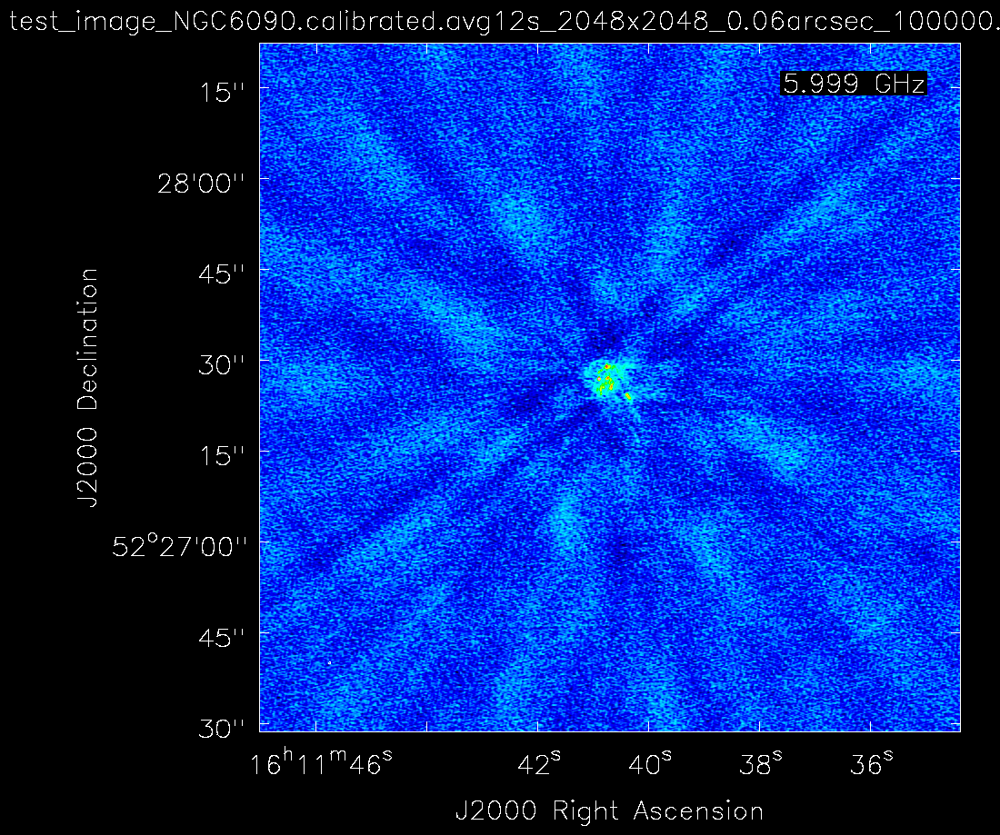
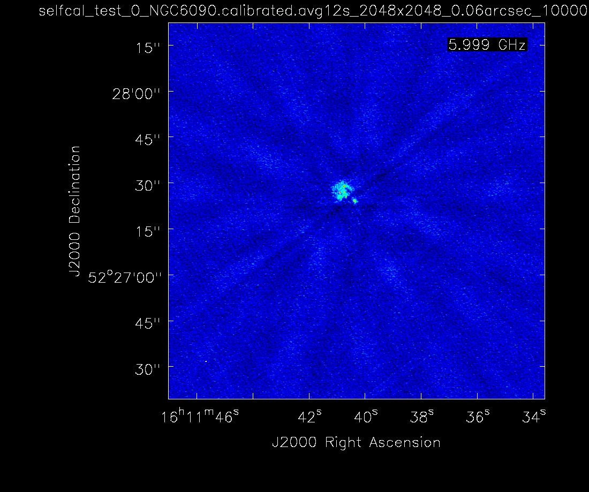
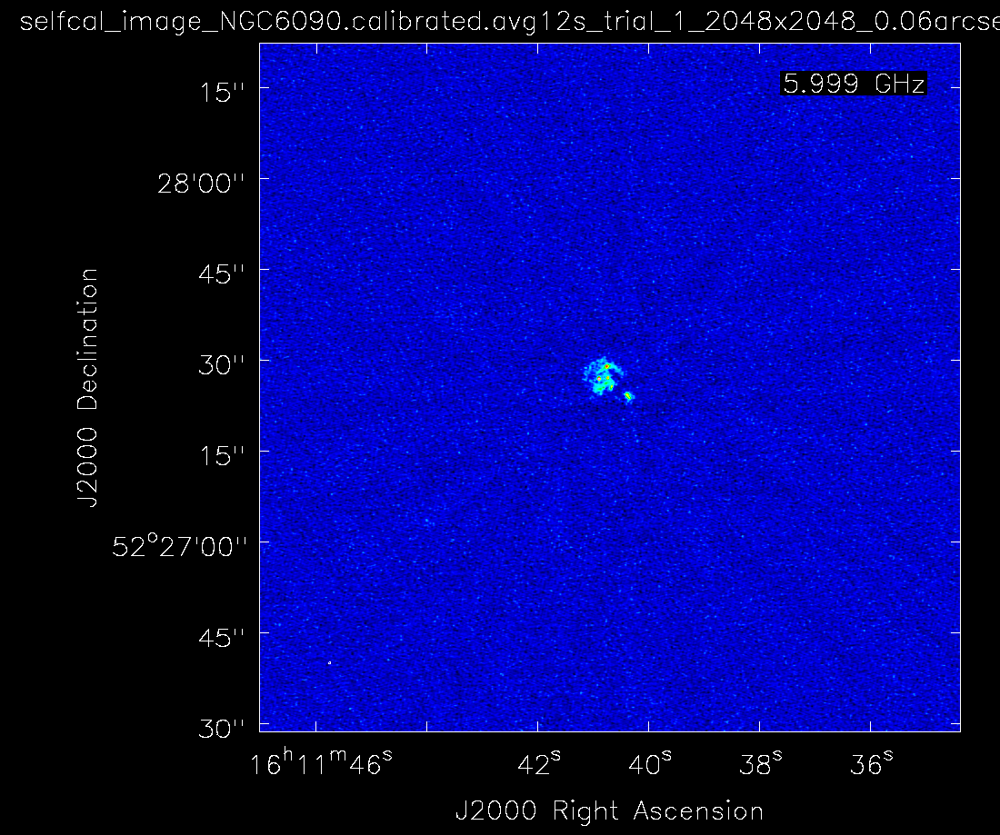
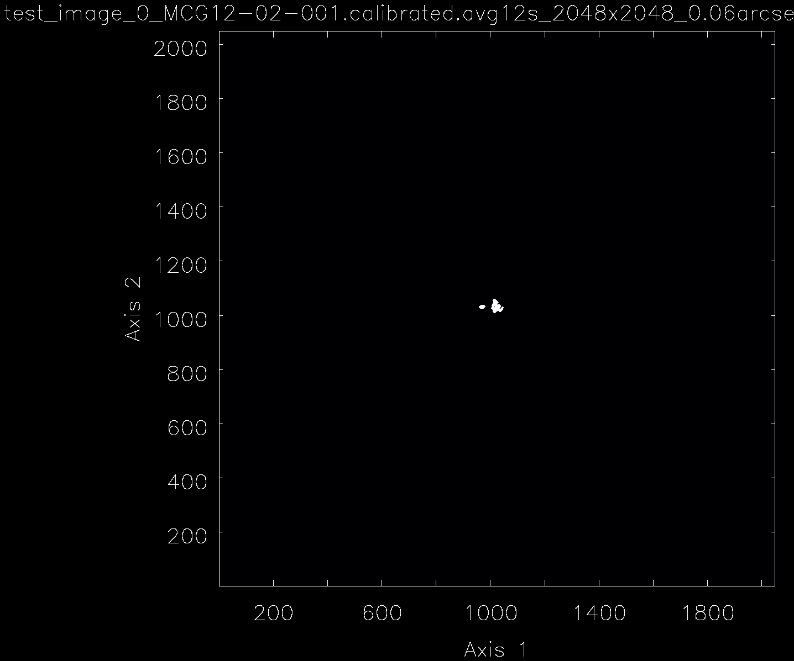
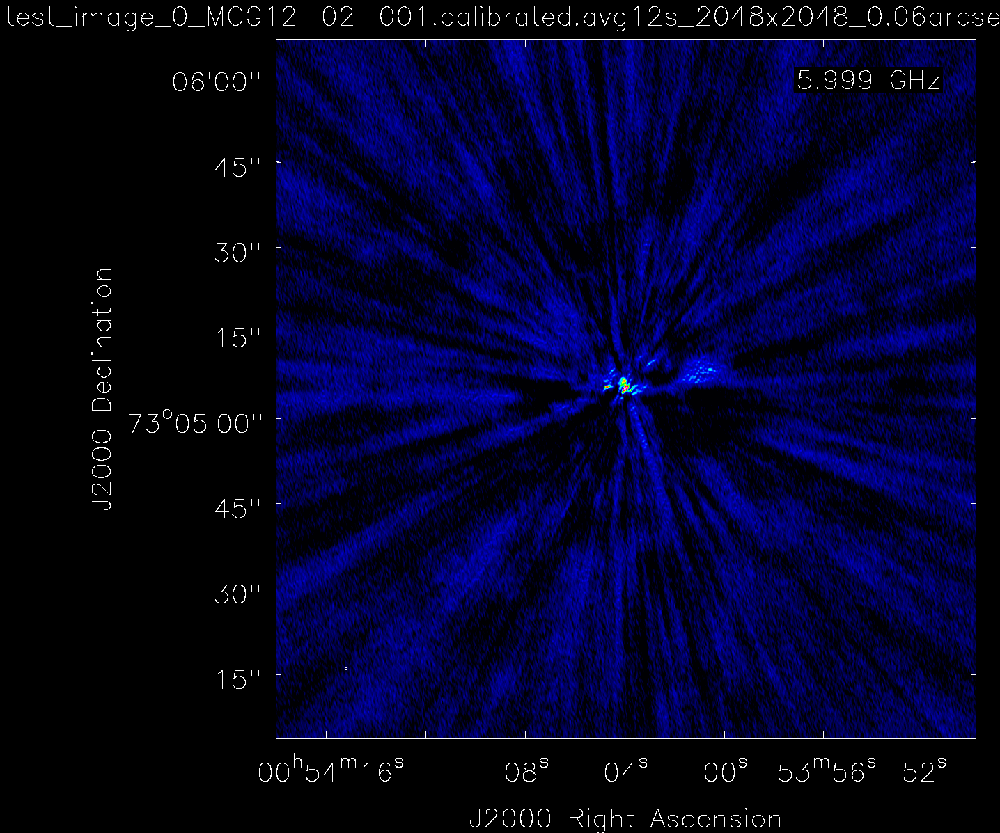

# Self-calibration Examples

As a recap, we remind that we use the following simple criteria to define how bright a given 
radio source is:
```python
def select_parameters(total_flux,snr=None):
    if total_flux < 10:
        params = params_very_faint.copy()
    elif 10 <= total_flux < 20:
        params = params_faint.copy()
    elif 20 <= total_flux < 50:
        params = params_standard_1.copy()
    elif 50 <= total_flux < 100:
        params = params_standard_2.copy()
    else:  # total_flux >= 100
        params = params_bright.copy()

    return params
```

## Self-calibration of a 'very faint/faint' source:

Original Image (`test_image`).
<br>
Total flux density of ~ 5.4 mJy.

For the step `p0`, the `very_faint` template was selected. Specifically, we have:
- `combine='spw'`
- `solint='96s'`


### Self-calibration results

Phase only applied (1x) (step `p0`)
<br>
Total flux density is ~ 7.8 mJy.


Phase+ampphase applied (step `ap1`), which uses phase table from step `p0`. Hence, the phase 
solutions contained in `ap1` are incremental to those in `p0`.
<br>

Total flux density is ~ 6.4 mJy.


Image levels are exactly the same. Total amount of data flagged is less than 10%.


## A case when the step `p0` improves significantly the image quality
Now we present a case where the `test_image` contains a total flux density less than 10 mJy, 
i.e. the `very_faint` template is selected. The `p0` steps improves significantly the 
image quality, resulting in a total flux density of ~ 22 mJy. Hence, for subsequent steps, 
the template `standard_1` is selected, which contains shorter solution intervals, hence 
correcting the more rapid phase variations.

For completeness, we also show the images and maks generated in all steps. 

`test_image`

Mask generated.
<br>
Resulting image


`selfcal_p0`

Mask generated.
<br>
Resulting image


`selfcal_p1`

Mask generated.
<br>
Resulting image


`selfcal_p2`

Mask generated.
<br>
Resulting image


`selfcal_ap1`

Mask generated.
<br>
Resulting image
<br>

[//]: # (## A case of a bright source with no significant improvements)

